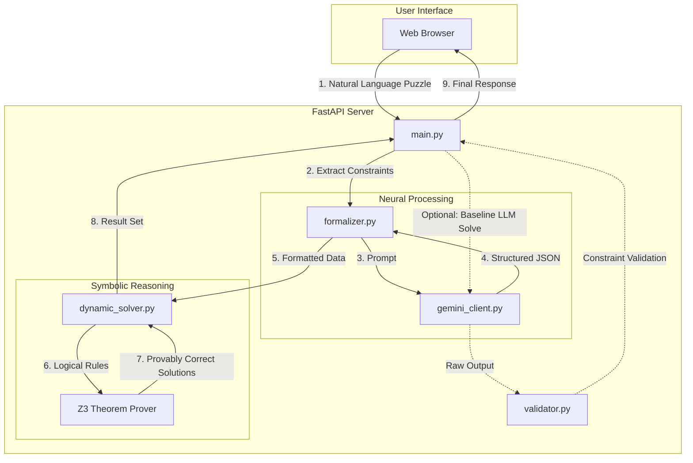

# 🧠 Neuro-Symbolic Seating Puzzle Solver

A sophisticated hybrid AI system that combines the probabilistic reasoning of **Large Language Models (Gemini)** with the deterministic logic of **Constraint Satisfaction Solvers (Z3)** to solve complex seating arrangement puzzles with 100% accuracy.


---

## 🏛️ System Architecture

The project employs a **Neuro-Symbolic** approach. While LLMs are excellent at understanding natural language, they often struggle with complex logical constraints. This system uses the LLM to "formalize" the natural language into a structured logical format, which is then solved by the Z3 theorem prover.



---

## ✨ Key Features

- **Hybrid Intelligence**: Combines LLM's language comprehension with Z3's mathematical precision.
- **Dynamic Formalization**: Automatically converts free-text puzzles into JSON-based constraint objects.
- **Z3 Integration**: Leverages Microsoft Research's Z3 solver to find all possible valid solutions.
- **Validation Engine**: Includes a validator to check raw LLM responses against extracted symbolic constraints.
- **Interactive UI**: A clean, modern frontend for inputting puzzles and visualizing solutions.

---

## 🛠️ Technology Stack

- **Frontend**: Vanilla JavaScript, CSS3 (Glassmorphism), HTML5.
- **Backend**: Python 3.x, FastAPI.
- **AI/Logic**: 
    - **Google Gemini API**: For natural language formalization.
    - **Z3-Solver**: For deterministic constraint satisfaction.
- **Deployment**: Procfile included for easy Render deployment and Vercel for Frontend.

---

## 🚀 Getting Started

### Prerequisites
- Python 3.8+
- Google Gemini API Key

### Backend Setup
1. Navigate to the backend directory:
   ```bash
   cd neuro_symbolic_puzzle/backend
   ```
2. Create and activate a virtual environment:
   ```bash
   python -m venv venv
   source venv/Scripts/activate  # On Windows
   ```
3. Install dependencies:
   ```bash
   pip install -r requirements.txt
   ```
4. Create a `.env` file and add your Gemini API key:
   ```env
   GEMINI_API_KEY=your_api_key_here
   ```
5. Run the server:
   ```bash
   python main.py
   ```

### Frontend Setup
1. Simply open `neuro_symbolic_puzzle/frontend/index.html` in your browser, or serve it using any static file server (e.g., Live Server in VS Code).

---

## 📁 Project Structure

```text
neuro_symbolic/
├── neuro_symbolic_puzzle/
│   ├── backend/
│   │   ├── main.py             # FastAPI entry point
│   │   ├── formalizer.py       # LLM formalization logic
│   │   ├── dynamic_solver.py   # Z3 integration
│   │   ├── gemini_client.py    # Gemini API wrapper
│   │   ├── validator.py        # Solution verification
│   │   └── requirements.txt    # Python dependencies
│   └── frontend/
│       ├── index.html          # Main UI
│       ├── style.css           # Modern styling
│       └── app.js              # UI interaction logic
└── README.md
```

---

## 🤝 Contributing

Contributions are welcome! Please feel free to submit a Pull Request.

1. Fork the Project
2. Create your Feature Branch (`git checkout -b feature/AmazingFeature`)
3. Commit your Changes (`git commit -m 'Add some AmazingFeature'`)
4. Push to the Branch (`git push origin feature/AmazingFeature`)
5. Open a Pull Request
